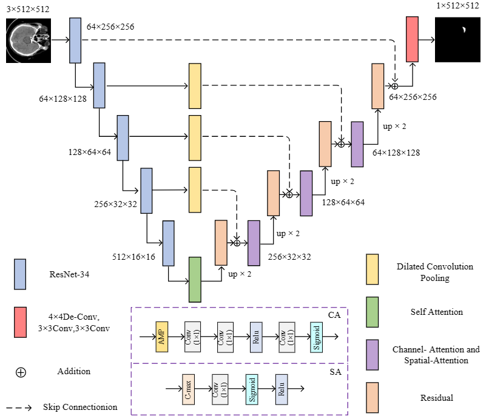
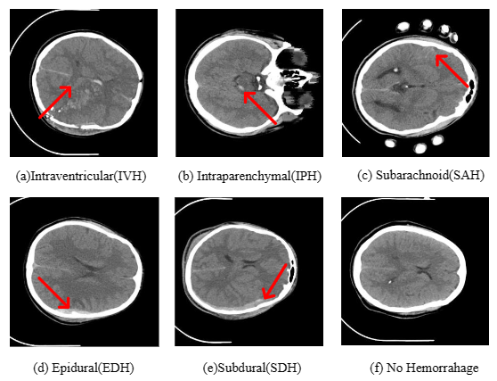
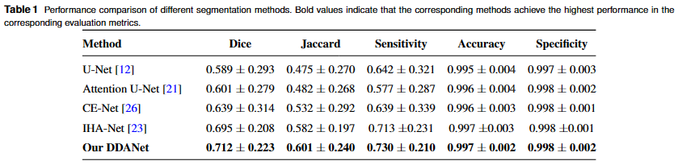
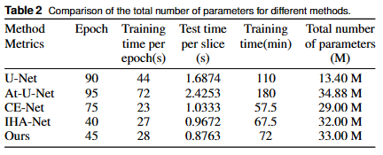
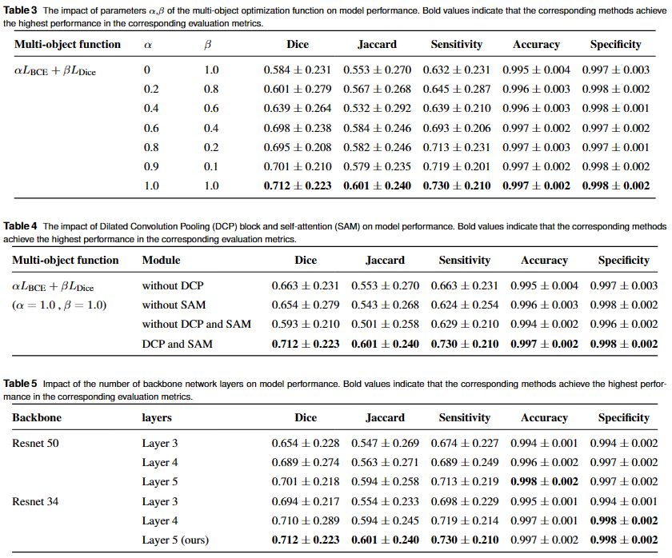
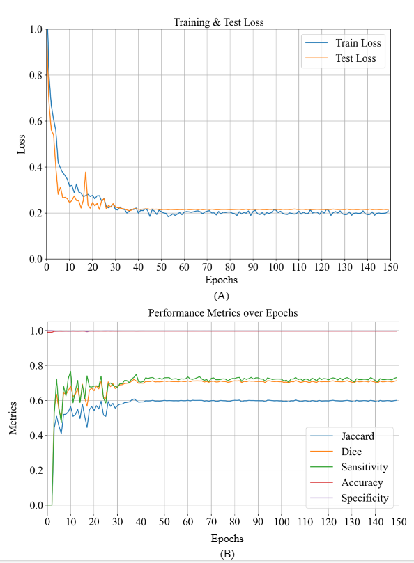
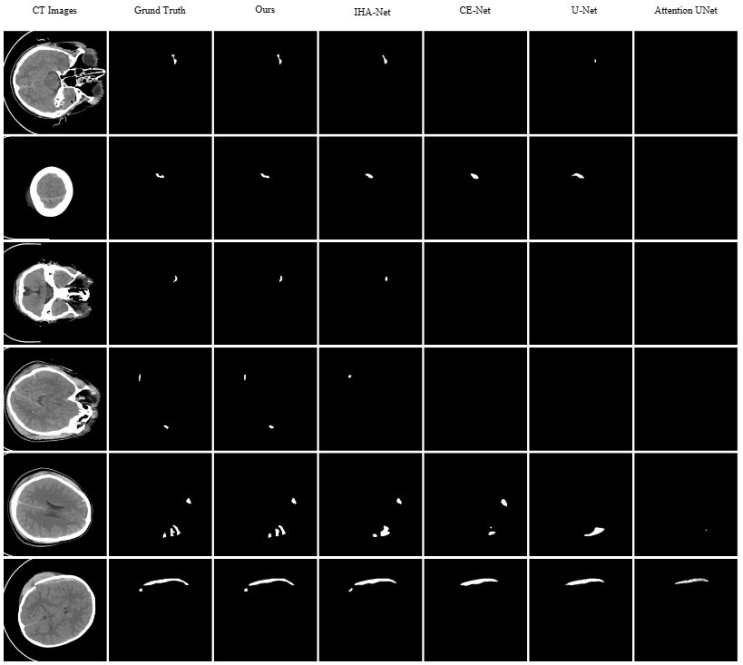

# DDANet: A Deep Dilated Attention Network for Intracerebral Hemorrhage Segmentation

DDANet is an enhanced U-Net with deep dilated attentions for th intracerebral hemorrhage segmentation.

## DDANet



*Fig. 2. The architecture of the proposed DDANet.*

## Datasets

download the dataset: [ICH(Preprocessed)](https://pan.baidu.com/s/1sP5-daDsDdI0oBpoQFJ15A?pwd=qr7d) and[ICH (Original Dataset)](https://pan.baidu.com/s/1HNB0b6zH84yX25-InZ8C4w?pwd=uu5v). 

more information refers to [Computed Tomography Images for Intracranial Hemorrhage Detection and Segmentation v1.3.1 (physionet.org)](https://physionet.org/content/ct-ich/1.3.1/)



*Fig. 1. Images with the different types of ICH: (a) Intraventricular (IVH); (b) Intraparenchymal (IPH); (c) Subarachnoid (SAH); (d) Epidural (EDH); (e) Subdural (SDH) and (f) No Hemorrhage.*

## Configs

#### requires

Python 3.9

CUDA 12.2

PyTorch 1.8

#### training

```bash
python train.py
```

#### testing

```bash
python test.py
```

## Results (Qualitative results)







## Results (Qualitative results)



*Fig. 3: Training and test procedure. (A) The training and test loss for the proposed method; (B) The evaluation metrics used during the testing phase.*

---



*Fig. 4.The visual segmentation results comparison chart for tiny lesion cases. From left to right: the original CT images, their corresponding ground truth masks, and the results  obtained by our DDANet, IHA-Net, CE-Net, U-Net and Attention UNet, respectively.*
