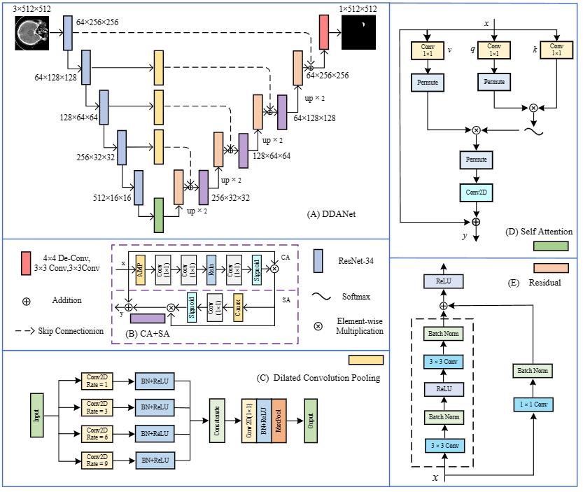

# DDANet: A Deep Dilated Attention Network for Intracerebral Hemorrhage Segmentation

DDANet is an enhanced U-Net with deep dilated attentions for Intracerebral Hemorrhage Segmentation.

## DDANet

s

*Fig. 2. The architecture of the proposed DDANet.*

## Datasets

download the dataset: [ICH(Preprocessed)]() and[ICH (Original Dataset)]().

## Configs

#### requires

Python 3.7+

CUDA 9.2+

PyTorch 1.8+

#### training

```bash
python train.py
```

#### testing

```bash
python test.py
```

## Results (Qualitative results)


## Results (Qualitative results)


*Fig. 8. Details of  tiny lesion cases are shown.*
